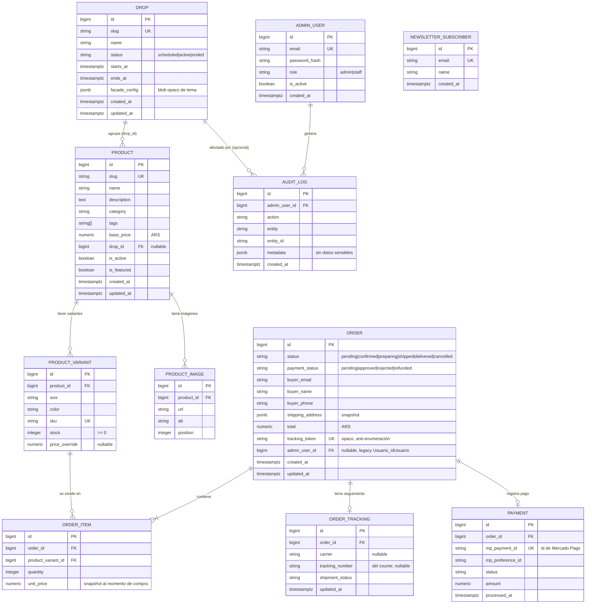

# Modelo de datos global (PostgreSQL) — Backend de Lute

Este documento define el **modelo de datos objetivo** y su relación con el modelo **actual**
(Sequelize) del repo. Es la referencia que usan todas las etapas. El detalle de columnas, índices y
migraciones por entidad vive en el `design.md` de cada etapa.

## 1. Estado actual vs. objetivo (resumen)

El frontend ya tiene un modelo de dominio rico en `src/types/index.ts` (`Product` con `slug`,
`images`, `sizes`, `colors`, `category`, `tags`; `Order` con estados y `trackingCode`). El backend,
en cambio, tiene un modelo mínimo (`Producto`: nombre/talle/color/precio/stock). El objetivo
**alinea el backend con ese dominio** sin romper datos existentes.

| Entidad actual (Sequelize) | Objetivo | Cambio principal |
| --- | --- | --- |
| `Producto` | `Product` + variantes | agregar slug, descripción, imágenes, categoría, asociación a drop; precio a `NUMERIC`; modelar variantes (talle/color) con stock por variante |
| `Compra` | `Order` | agregar email + snapshot de datos de envío/pagador a nivel orden; token de seguimiento; FK a `Usuario` pasa a opcional |
| `Producto_has_Compra` | `OrderItem` | snapshot de precio/cantidad por variante |
| `Usuario` | `AdminUser` (empleados) | agregar `password_hash` + `role`; deja de ser "cuenta de comprador" |
| `Newsteller` | `NewsletterSubscriber` | se conserva (email único) |
| — | `Drop` | **nueva** (etapa 06) |
| — | `OrderTracking` / estados de envío | **nueva** (etapa 04) |
| — | `AuditLog` | **nueva** (etapa 05) |
| — | `Payment` (opcional) | **nueva** (etapa 03, para idempotencia/registro MP) |

> **Compatibilidad:** se conservan los nombres de tabla existentes (`Producto`, `Compra`,
> `Usuario`, `Newsteller`, `Producto_has_Compra`). Las entidades nuevas se crean con migraciones.
> La transición de "Usuario como comprador" a "Usuario/AdminUser como empleado" se hace en la
> etapa 05 con migración de datos cuidada.

## 2. Diagrama entidad-relación (objetivo)

## 3. Notas de modelado clave

1. **Variantes y stock.** El stock es **por variante** (`PRODUCT_VARIANT.stock`), no por producto.
   El modelo actual mete talle/color/stock en `Producto`, lo que ya genera filas duplicadas por
   color (ver los `INSERT` de ejemplo en `models/Producto.ts`). La etapa 01 normaliza esto.
2. **Dinero.** Todos los importes en `NUMERIC(12,2)` (o enteros en centavos). **No usar `FLOAT`**
   (el `precio` actual es `FLOAT` → migrar). Evita errores de redondeo en totales y pagos.
3. **Snapshots.** `ORDER_ITEM.unit_price` y `ORDER.shipping_address`/`buyer_*` se **congelan** al
   momento de la compra: aunque cambie el precio o se borre un producto, la orden histórica no muta.
4. **Sin cuenta de comprador.** El comprador no es una fila reutilizable; sus datos viven en la
   orden (`buyer_email`, `buyer_name`, `buyer_phone`, `shipping_address`). `ADMIN_USER` es para
   empleados. La FK legacy `Compra.Usuario_idUsuario` se mantiene como `admin_user_id` opcional o
   se retira según la etapa 04/05.
5. **Token de seguimiento.** `ORDER.tracking_token` es **opaco y aleatorio** (UUID/nanoid), único,
   **no derivable** del id ni del email. Es la clave de acceso a la sección pública de seguimiento
   (anti-enumeración; ver etapa 04 y `security-baseline.md`).
6. **Drop opaco.** `DROP.facade_config` es `jsonb` que el backend **no interpreta**: solo valida que
   sea JSON válido y acotado en tamaño (ver `drop-system.md`).
7. **Auditoría.** `AUDIT_LOG` registra acciones de admin (alta/edición de productos y drops, login)
   **sin** almacenar contraseñas, tokens ni datos de tarjeta.

## 4. Integridad y rendimiento

- **Claves foráneas** con `ON DELETE` explícito (p. ej. `RESTRICT` para no borrar productos con
  órdenes; `CASCADE` para imágenes/variantes al borrar un producto inactivo).
- **Índices** sugeridos: `product(slug)`, `product(drop_id)`, `product_variant(sku)`,
  `order(tracking_token)`, `order(buyer_email)`, `payment(mp_payment_id)`, `drop(status)`.
- **Restricción de stock:** `CHECK (stock >= 0)`; el descuento de stock en pagos se hace dentro de
  una **transacción** con bloqueo de fila (`SELECT ... FOR UPDATE`) para evitar sobreventa
  (condición de carrera; ver etapas 03/07).
- **Unicidad del drop activo:** garantizar a lo sumo un `status = 'active'` (índice parcial único o
  control transaccional; etapa 06).

## 5. Migraciones

Se adopta **migraciones versionadas** (`sequelize-cli`/`umzug`) en reemplazo de
`sequelize.sync({ alter: true })`. Cada etapa que toque el esquema entrega su(s) migración(es)
*up/down* y, si aplica, una migración de datos. `sync` queda restringido al entorno de **test**.
